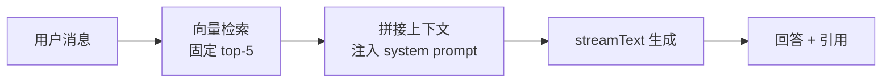
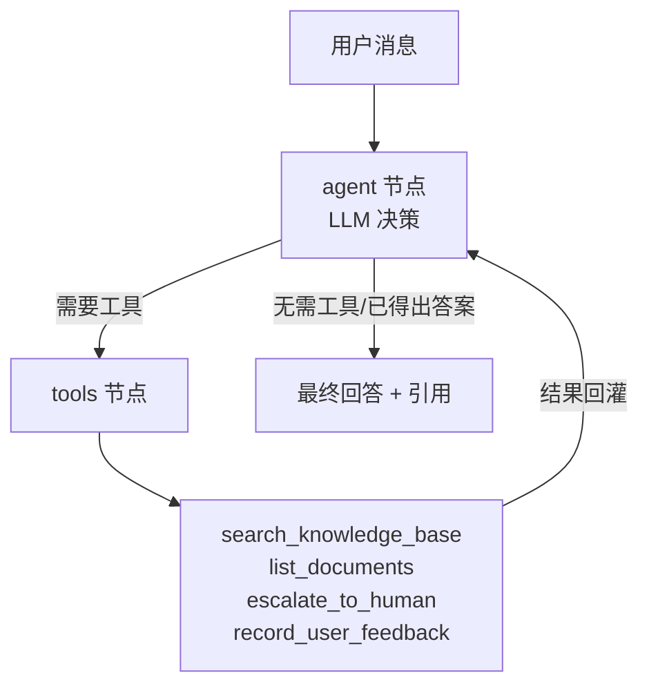

# AI 客服知识库 SaaS — V2 Agent 化升级技术报告

> 本文档面向技术读者，记录本项目从 **V1 线性 RAG 应用** 升级为 **V2 LLM 自主决策 Agent 应用** 的架构演进、量化结果与关键技术决策。所有数字均来自项目内可复跑的评估脚本，附诚实的样本与口径说明。

---

## 1. 项目概述

企业级多租户 AI 知识库 + 智能客服 SaaS：企业（B 端）上传文档 → 自动切块向量化 → 生成公开链接给终端用户（C 端）对话问答。回答严格基于知识库检索、引用原文、知识库外问题拒答。

技术栈：Next.js 15 App Router + TypeScript（strict）、Supabase（Postgres + pgvector + RLS）、Vercel AI SDK v4 流式响应、LangChain.js / LangGraph 1.x 生态、SiliconFlow（embedding `BAAI/bge-m3` 1024 维 + 对话 `DeepSeek-V3` + 重排 `BAAI/bge-reranker-v2-m3`）。

**V2 升级方向**：把"固定流程的检索增强生成"改造为"模型自主决定是否检索、检索几次、调用哪个工具"的 Agent，并补齐可观测、量化评估、检索精排三块工程能力。

---

## 2. 架构演进：从线性 RAG 到 Agent

### V1 — 线性 RAG

模型没有任何决策空间，上下文是固定注入的：

### V2 — LangGraph 状态图 Agent

模型自主决策要不要调工具、调哪个、调几次，工具结果回灌可多轮循环：

**形态上的本质变化**：检索从"必然发生的第一步"变成"模型可选调用的工具之一"；引入工具多样性（4 个工具）让模型真正在做决策，而不只是换一种方式调 RAG。

---

## 3. 量化评估：V1 / V2 / V2+Reranker 三方对比

### 评估方法（口径 A：评检索器，不评 Agent 决策）

为得到与 V1 严格可比的数字，评估**直接调用底层检索逻辑**（同一 embedding、同一向量匹配 RPC），不经过 LLM 的"要不要检索/检索几次"决策——后者会引入决策噪声，无法和 V1 的固定检索对齐。测试集为 44 题章节级 ground truth（基于一份虚构产品手册构建的纯净评估租户），主指标取 **Recall@1 + MRR**（Recall@5 因评估库规模小已饱和、失去区分度，仅作召回完整性参考）。

### 结果

| 阶段 | Recall@1 | MRR |
|---|---|---|
| V1 baseline | 0.9318 | 0.9602 |
| V2（Agent 化后） | 0.9318 | 0.9602 |
| V2 + Reranker | **0.9545** | **0.9667** |

### 两个诚实结论

**(1) Agent 化未劣化检索（V1 = V2，字节级一致）。** V2 的检索算法与 V1 完全同源（工具内部仍调用未改动的 RAG 实现），因此指标必然相等——这不是 bug，而是"加入 LangGraph 状态图、工具调用、鲁棒性防护后，检索质量没有被破坏"的正向证明。V2 的价值兑现在工具能力、降级容错与全链路可观测，而非检索分数本身。

**(2) Reranker 带来真实正向增益，但样本置信度有限。** 召回 top-20 经 `BAAI/bge-reranker-v2-m3` 精排取 top-5 后，在 44 题集上修正了 1 题 top-1 命中（q015 翻盘），净 ΔRecall@1 = +0.0227 / ΔMRR = +0.0065。受评估库规模限制（11 chunk），单题翻盘的统计置信度有限；但重排机制经全样本 `rerank_score` 分布（min 0.2146 / median 0.9110 / max 0.9988，无零值）证实真实生效。**此处刻意不表述为"提升 2.27%"**——分清"哪一步带来什么价值"的诚实，比夸大的百分比更可信。

---

## 4. 拒答稳定性（口径 B：评 Agent 决策层）

Agent 化带来一个新问题：模型有了自主决策空间后，对"知识库检索不到的问题"时而拒答、时而调用通用世界知识硬答（例如直接输出一段斐波那契代码）。这属于 **Agent 决策层** 问题——检索器照常返回零命中，是模型自己选择了硬答，因此用第 3 节"只评检索器"的口径 A 测不出来，需要**口径 B：端到端跑完整 Agent，取模型最终输出文本，判定其是否拒答**。

### 加固手段

通过加固 system prompt 实现：要求模型对任何需要事实/知识/操作步骤的问题先查知识库、严禁绕过工具基于自身知识作答；对零命中或超出知识库范围的问题（即便模型有能力回答）一律使用固定标准拒答话术。配套放宽拒答检测的文本匹配规则，使标准话术能稳定命中、正确清空错误引用。

### 结果

| 指标 | 加固前 | 加固后 |
|---|---|---|
| 库外问题拒答率（应拒答） | 55% | **93.3%** |
| 库内问题误拒率（不应拒答） | 0% | **0%** |

**评估方法与诚实标注**：库外测试集 20 题（编程/常识/时事/数学，编程类按"最易诱发硬答"加权），库内对照取全部 44 题；均端到端跑 Agent，各复跑 3 次取逐题稳定性。加固后库外拒答率 93.3%（3 次为 20/19/17），库内 0 误拒（3 次稳定，含相似度最低的边缘题）。

由于对话模型默认采样温度非零（约 0.7），软约束（prompt）无法做到确定性 100%。剩余漏拒集中在"任务感"边界题（如单位换算），表现为偶发硬答（如 3 次中 1 次），无任一题稳定硬答。这是 prompt 软约束的合理上限，作为已知残留如实记录，未为追求满分而过度加重约束（过强约束会抬高库内误拒风险，而库内零误拒是更重要的安全指标）。

---

## 5. 关键技术决策

**LangGraph.js 单体，不拆 Python 微服务。** 继续在 TypeScript 单体内实现 Agent，避免引入跨语言服务边界。代价是流式桥接需手写（官方 `@ai-sdk/langchain` adapter 的版本严格锚定 `ai` 主版本，与项目锁定的 v4 不兼容），但换来部署与维护的简单。

**先接可观测，再做架构改造。** 把 LangSmith trace 接入与 LangChain 生态版本统一放在改造之前完成——"升级 core 主版本"这个高风险动作不与"最大的业务改造"叠加在同一步，地基先稳，后续每一步的调试都有完整 trace 可依。

**评估只评检索器（口径 A），不端到端评 Agent。** Agent 的"要不要检索"决策与拒答不稳定会污染检索质量的度量，因此 V1↔V2 对比锁定在检索器层同源比较，得到可信、可复跑、不掺水的数字。评 Agent 决策层行为（如拒答稳定性）时另用口径 B，二者互补不可替代。

**Reranker 选型先用 SiliconFlow 自带模型起步。** 与 embedding/对话共用同一 API key 与 baseURL，零接入成本；接入后用同一套评估集量化增益，若不达预期再切换业界标杆模型——切换成本极低（仅改一处调用），决策由数据驱动而非预先押注。

**接入点圈在 Agent 工具内，RAG 实现零改。** Reranker 接在检索工具的工厂函数内，而非底层检索模块，使影响面收敛在 Agent 工具范围，底层 RAG 与 V1 保持字节级一致——这也是第 3 节 V1=V2 能成立的前提。

---

## 6. 工程踩坑节选

**流式 + 工具调用的三连坑（LangChain/LangGraph + OpenAI 兼容协议）。** 在脏脚本里探路"LangGraph 流输出 → AI SDK v4 桥接"时连撞三坑：`streaming:true` 下工具调用增量不自动聚合导致工具永不执行；手动聚合得到的 chunk 类型不继承完整消息类型导致路由判断失效；流模式如实暴露每次 LLM 调用的 token 增量需精确过滤。三坑全部在脏脚本里撞平、挡在生产文件之外——"凡是要把新 SDK 接进现役路由，先在脏脚本跑通最小链路再进生产文件"成为固定纪律。

**验收前必须确认"测的是哪一版代码"。** 一次改完本地代码后验收，看到"一切正常"，交叉核对数据库时间戳才发现：浏览器打开的是线上旧版本，本地新代码根本没在跑。教训沉淀为"代码自洽 ≠ 运行事实"——解释运行结果前先排查"到底哪一版在跑"，数据与代码描述冲突时以运行产物为裁决。这条纪律在后续前端时序 bug、commit 卫生检查中反复应验。

**评估方法论：单点观察不能外推全样本。** Reranker 接入时基于单个 query 的 spike 观察预判"指标必持平"，全量评估直接推翻（实际改了 15/44 题 top-1）。spike 的价值在"验证机制能跑通"，不在"预测指标分布"；任何指标结论必须跑完整评估集。同样地，prompt 加固时单次跑出库外 100%，复跑 3 次才现出真实的 93.3%——单次高分是采样运气，软约束效果必须多次复跑取逐题稳定性。

**口径分裂是有意设计，不是不一致。** 同一个 reranker，在生产链路里失败时静默回退（保用户可用性），在评估脚本里失败时直接抛错中止（保评估数据纯净，不让某些题偷偷用回退顺序污染指标）。两种相反取向各自正确，注释写死防止后人照搬。

**红线冲突时停下列方案，不硬干、不自作主张。** 多次出现"规划指令与既有红线冲突"或"指令自相矛盾"的情形（如"加超时"与"文件不动"硬冲突）。正确动作是停下、把冲突显式列清、给候选方案与倾向、交由上层拍板——执行端接住规划端的疏漏，正是双角色协作的价值。

---

## 7. 技术栈、边界与已知残留

**版本锁定（关键项）**：Next.js 15.5.15、React 19、Tailwind 4、Vercel AI SDK `ai@^4`（主动从 v6 降级以保流式 API 稳定）、LangChain.js 生态统一 1.x（以 LangGraph 1.x 对 core 的要求为锚）、pnpm。

**明确跳过（非遗漏，是范围决策）**：Prompt Caching、长任务异步化、多 Agent 编排、Human-in-the-loop。OCR 与超长文档异步化作为产品功能边界，留待真实需求触发。

**已知残留（诚实标注）**：
- 评估库规模偏小（11 chunk），Reranker 增益与拒答评估的统计置信度受限——结论方向真实，强度待真实客户知识库规模增长后重测加强。
- 拒答稳定性在"任务感"边界题上存在软约束天花板（偶发硬答），属 prompt 非确定性的固有特性，已如实记录。
- 速率限制基于内存 Map，在多实例 Serverless 下不跨实例共享——真实滥用出现时切换分布式方案。

---

*本文档数据来源于项目内可复跑的评估脚本与提交历史，口径与样本局限均如实标注。*